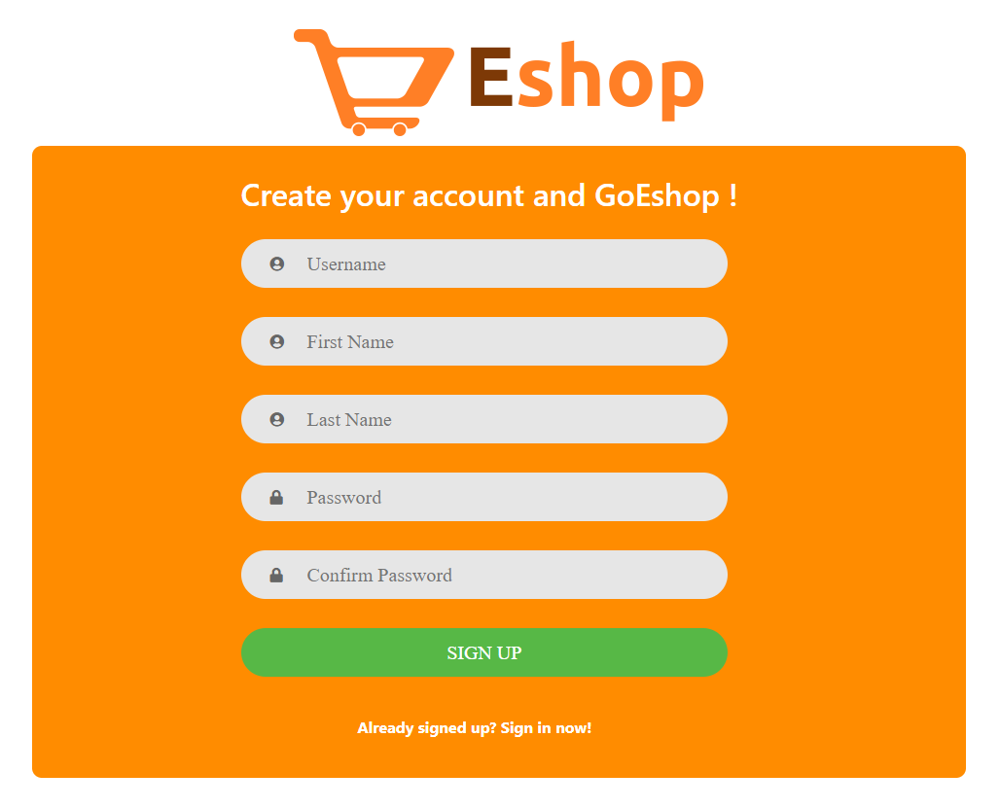
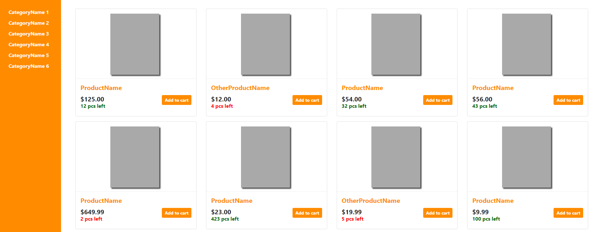

<h1> GoEshop </h1>

## About the project
It is a webservice with shop structure. Frontend part of the client application was built with Angular 9, whereas Java with Spring Framework was used to create backend part, which is connected to MS SQL database using JPA and some SQL stored procedures. Spring security was used as an authentication service.

### Built with
* Java 14
* Spring
* Spring boot
* JPA
* MS SQL
* Angular 9
* Bootsrap 4

### Functionality description
This Eshop service allows all users to create their own accounts. Only authenticated users are able to look through the list of products. They are able to filter products by category or type the name of the product that they are looking for. They can also see the details of each product and obviously, they can add product to the cart. Users are also able to manage the cart details, but the payment service is not available yet. A "Basic User" role will be automatically assigned to all accounts created from the website. "Administrator" role also exists, however it can be assigned to the account only from the database level. Some additional features are reserved to admins. Only administrators are able to add new products to the shop, add new categories or permanently delete the products. 

## Screenshots

<h5 align="center"> Account Views </h5>

  
  
  

<h5 align="center"> Products list and searching </h5>

  
  

<h5 align="center"> Products details </h5>

  

<h5 align="center"> Cart Overview </h5>

  

<h5 align="center"> Admin Features </h5>

  
  

  
  

<h3 align="center"> Basic User Main Page Overview </h3>

  

<h4 align="center"> Signing out </h4>

  

